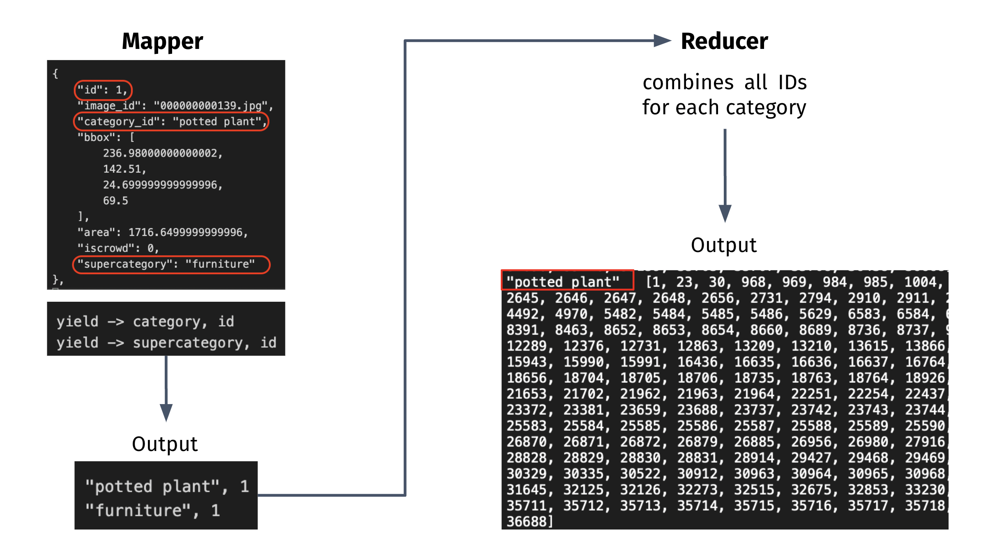
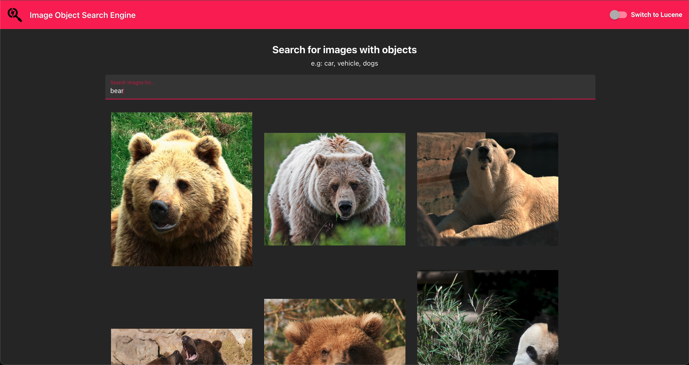

# Image Content Search Engine 

Designed and developed an image search engine using Hadoop Inverted Indexes and Lucene indexing which returns the images pertaining to the input query by the user. Employed FiftyOne API - an object detection software - to detect objects in an image and use the indexed objects called annotations to match with the query. These images are ranked for relevancy using the area of bounding boxes of each annotation and then returned to the frontend to be displayed on the browser.

## architecture

## mapreduce example

## ranking algorithm

## web app
Search query: `Bear` mode: `Hadoop with Area Ranking`

Search query: `Motorcycle` mode: `Hadoop with Area Ranking`

Search query: `Motorcycle` mode: `Lucene with TF-IDF Ranking`

